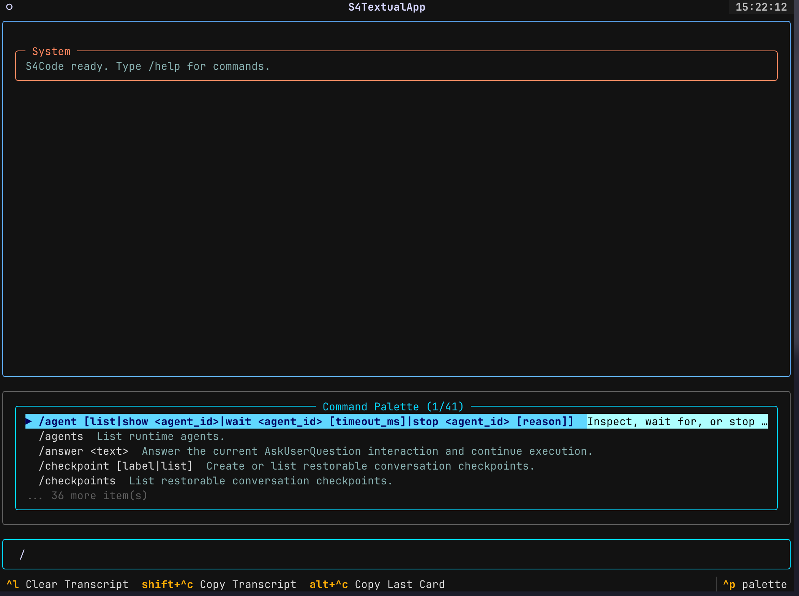
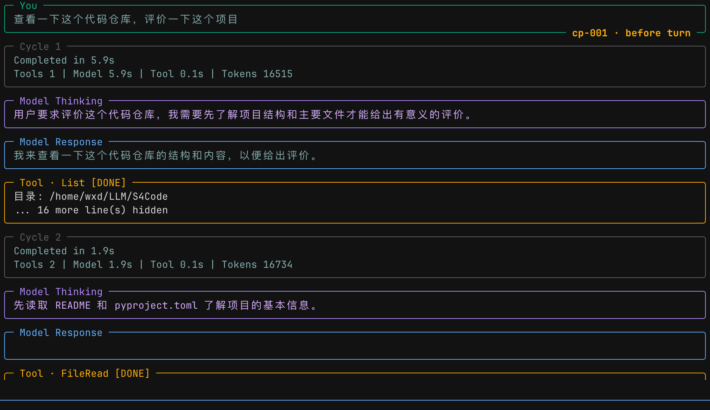
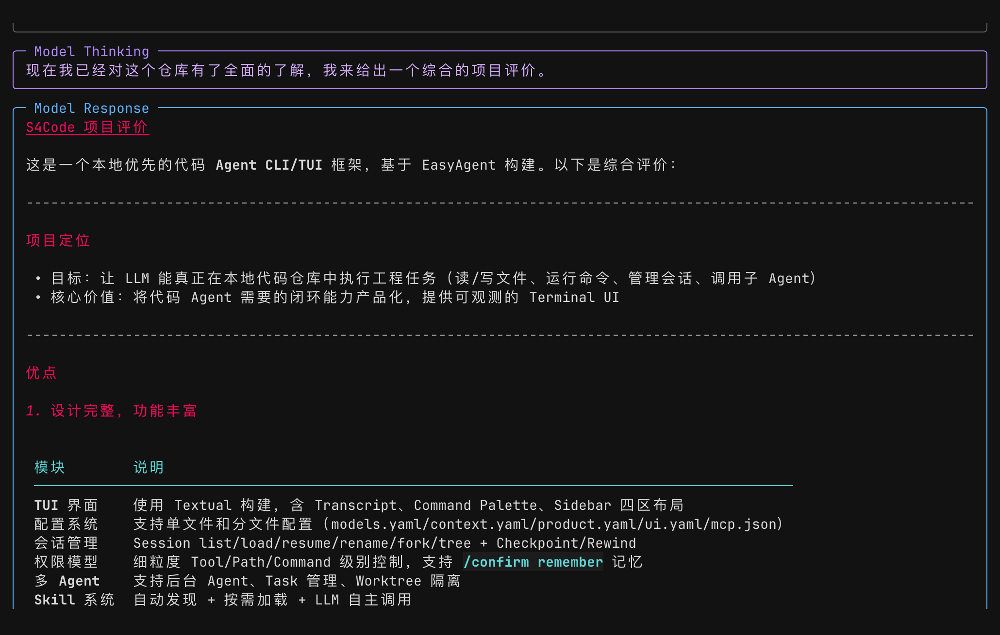
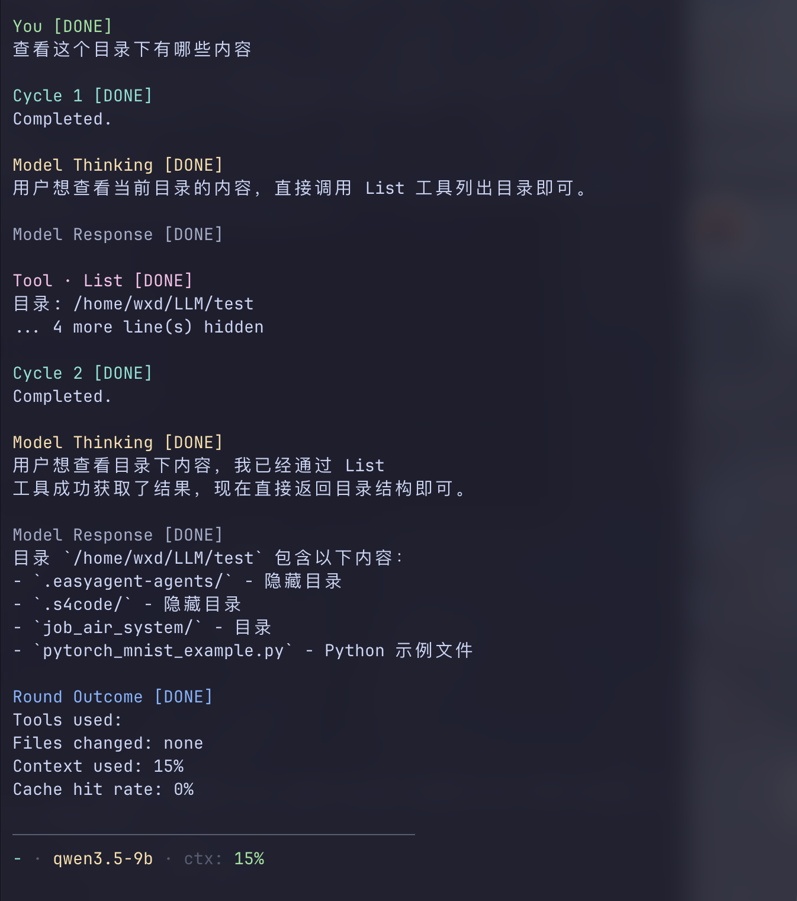

# S4Code

S4Code 是一个本地优先的代码智能体终端产品。它面向真实代码仓库工作，可以读取和修改文件、运行命令、审查 diff、管理会话、使用 skills、连接 MCP 服务、显示上下文与 token 使用情况，并在终端里展示完整的 agent 执行过程。

S4Code 构建在 EasyAgent 之上。EasyAgent 负责 Agent、Tool、MCP、Skill、记忆和运行时能力；S4Code 在它之上提供面向代码仓库的产品层，包括配置、系统提示词、权限、会话、TUI、命令体系、检查点、worktree 和用户体验。

## Core 与对外接口

产品主体是 S4Code Core，`S4CodeAgent(BasicAgent)` 只是其中的 Agent 组件。Core 还包括产品运行入口、会话、配置、权限和结构化事件。CLI、Textual、Python SDK 是平级入口，分别调用 Core；Ink 与 TypeScript SDK 共用独立 Bridge Client，通过无界面的 Bridge Server 调用 Core。没有 Agent Bundle、`easyagent_adapter` 或 `QueryEngine`。Checkpoint/rewind 的策略属于各 TUI，只回溯会话上下文，不撤销磁盘文件或外部操作。

- [重构后的代码结构、职责与扩展规则](docs/architecture.md)
- [Python SDK、CLI、TUI 和 bridge 使用指南](docs/usage.md)
- [可运行的 Python SDK 示例](example/sdk_usage.py)

仅使用 SDK 不需要安装 Textual，也不会导入终端层。

## 适合什么场景

S4Code 适合在本地代码仓库中完成多步骤软件工程任务：

- 阅读一个陌生仓库并解释主流程。
- 修复 bug、失败测试、类型错误或运行时异常。
- 实现新功能，并按项目现有风格修改代码。
- 审查当前 git diff，重点发现 bug、回归风险和缺失测试。
- 运行命令、测试、格式化、诊断脚本，并根据结果继续修复。
- 在长任务中通过会话恢复、检查点和 rewind 管理上下文。
- 使用 MCP 接入外部文件系统、GitHub、数据库、浏览器或其它工具服务。
- 使用 skills 给某一轮任务加载专门能力，例如代码审查、文档生成、翻译、框架专家经验等。

如果你只需要普通聊天，S4Code 不是最轻量的选择；如果你需要一个能在真实仓库里持续工作的代码 agent，S4Code 的设计目标就是这个场景。

## 当前前端

S4Code 提供两个终端前端，它们共享 Core 的配置、会话与运行能力，各自维护命令注册表和展示逻辑。

| 前端 | 命令 | 说明 |
| --- | --- | --- |
| Python TUI | `s4code` / `s4` | 默认入口，基于 Textual，功能最完整。 |
| TypeScript TUI | `s4code-ts` / `s4ts` | 基于 React + Ink，通过 Python bridge 调用同一套后端。 |

推荐优先使用 `s4code`。如果你想使用 Ink 风格的 TS 前端，或者正在调试 TS UI，可以使用 `s4code-ts` / `s4ts`。

## 截图

### Python TUI





### TypeScript TUI



## 环境要求

基础要求：

- Python `>= 3.10`
- Git
- 一个 EasyAgent 可用的模型配置
- 如果使用 TS 前端，需要 Bun `>= 1.1`

可选能力依赖：

- 使用 MCP 的本地 server 时，可能需要 `node` / `npx` / `uvx`。
- 使用 LSP / code intelligence 时，需要对应语言的 language server。
- 使用 git worktree 能力时，当前目录需要是 Git 仓库。

## 安装

### 1. 安装 EasyAgent

如果你使用本地 EasyAgent 源码开发，推荐 editable 安装：

```bash
pip install -e /path/to/EasyAgent
```

如果 EasyAgent 后续更新了 Python 代码，editable 安装通常只需要重启 S4Code；如果 EasyAgent 更新了依赖，需要重新安装依赖。

### 2. 安装 S4Code Python 包

```bash
cd /path/to/S4Code
pip install -e '.[tui]'
```

安装后会得到两个等价命令：

```bash
s4code
s4
```

### 3. 安装 TypeScript 前端依赖

只有使用 TS 前端时才需要这一步：

```bash
cd /path/to/S4Code/ts
bun install
```

如果你希望在任意目录直接运行 `s4code-ts` / `s4ts`，可以创建符号链接：

```bash
ln -sf /path/to/S4Code/ts/bin/s4code-ts ~/.local/bin/s4code-ts
ln -sf /path/to/S4Code/ts/bin/s4code-ts ~/.local/bin/s4ts
```

确保 `~/.local/bin` 在 `PATH` 中：

```bash
export PATH="$HOME/.local/bin:$PATH"
```

### 4. 验证安装

```bash
s4code --help
s4code config
```

TS 前端验证：

```bash
s4ts --prompt /status
```

如果 TS bridge 找不到 Python 包，可以显式指定 S4Code 使用的 Python：

```bash
export S4CODE_PYTHON=/path/to/python
```

## 首次配置

S4Code 不内置模型参数。第一次运行前，必须配置至少一个 `model_profiles`。

全局配置目录：

```text
~/.config/s4code/
```

项目配置目录：

```text
<project>/.s4code/
```

数据目录：

```text
~/.local/share/s4code/
```

缓存目录：

```text
~/.cache/s4code/
```

这些目录遵循 XDG 环境变量：

- `XDG_CONFIG_HOME`
- `XDG_DATA_HOME`
- `XDG_CACHE_HOME`

### 推荐配置文件结构

S4Code 支持单文件配置，也支持拆分配置。推荐使用拆分配置，便于维护。

```text
~/.config/s4code/
├── models.yaml
├── context.yaml
├── product.yaml
├── ui.yaml
├── mcp.json
└── S4.md
```

项目级配置使用相同结构：

```text
<project>/.s4code/
├── models.yaml
├── context.yaml
├── product.yaml
├── ui.yaml
├── mcp.json
├── S4.md
└── skills/
```

也可以使用合并配置：

```text
~/.config/s4code/config.yaml
<project>/.s4code/config.yaml
```

### 配置加载顺序

后加载的配置会覆盖先加载的配置。

1. 全局 legacy `config.json`
2. 全局 `config.yaml`
3. 全局拆分配置：`models.yaml`、`context.yaml`、`product.yaml`、`ui.yaml`
4. 项目 legacy `.s4code/config.json`
5. 项目 `.s4code/config.yaml`
6. 项目拆分配置：`.s4code/models.yaml`、`.s4code/context.yaml`、`.s4code/product.yaml`、`.s4code/ui.yaml`
7. MCP 配置：全局 `mcp.json` 与项目 `.s4code/mcp.json` 按 server name 合并
8. 会话级覆盖，例如 `/model` 或 `/theme` 在当前会话中的切换

同一个目录内，拆分配置会覆盖 `config.yaml` 中对应部分。项目配置会覆盖全局配置。

### 最小可用 models.yaml

下面是 OpenAI 兼容接口的示例。`provider` 的具体值取决于 EasyAgent 当前支持的 provider。

```yaml
active_model_profile: default

model_profiles:
  default:
    provider: openai
    model: gpt-4.1
    base_url: null
    api_key: null
    temperature: 0.2
    max_tokens: null
    timeout: 120
    reasoning_effort: medium
    reasoning_summary: null
```

如果你使用本地 OpenAI-compatible 服务：

```yaml
active_model_profile: local

model_profiles:
  local:
    provider: anthropic_native
    model: qwen3.5-9b
    base_url: http://127.0.0.1:5124
    api_key: "local-key"
    temperature: 0.5
    max_tokens: null
    timeout: 120
    reasoning_effort: medium
    reasoning_summary: null
```

多个模型配置示例：

```yaml
active_model_profile: fast

model_profiles:
  fast:
    provider: openai
    model: gpt-4.1-mini
    base_url: null
    api_key: null
    temperature: 0.2
    max_tokens: null
    timeout: 120
    reasoning_effort: medium
    reasoning_summary: null

  strong:
    provider: openai
    model: gpt-4.1
    base_url: null
    api_key: null
    temperature: 0.2
    max_tokens: null
    timeout: 180
    reasoning_effort: medium
    reasoning_summary: null
```

切换模型：

```text
/model
/model fast
/model strong
```

### context.yaml

```yaml
enabled: true
max_tokens: 24000
history_compactor: llm
recent_turns: 4
```

字段说明：

| 字段 | 说明 |
| --- | --- |
| `enabled` | 是否启用上下文管理。 |
| `max_tokens` | S4Code 用于估算上下文窗口的最大 token 数。 |
| `history_compactor` | 历史压缩方式，目前常用 `llm`。 |
| `recent_turns` | 压缩时尽量保留最近多少轮完整对话。 |

查看上下文：

```text
/context
```

手动压缩：

```text
/compact
/compact 12000
/compact partial 12000
```

### product.yaml

```yaml
permission_mode: accept_edits
permission_rules: []
permission_history: []
enable_codeintel: true
enable_mcp: true
enable_worktree: true
git_binary: git
shell: bash
command_timeout_ms: 120000
max_background_tasks: 4
session_auto_save: true
default_review_depth: full
enable_verifier: true
```

常用字段：

| 字段 | 说明 |
| --- | --- |
| `permission_mode` | 权限模式。常见值包括 `accept_edits`、`dont_ask`、`bypass`、`plan`。 |
| `permission_rules` | 会话或配置中的工具权限规则。 |
| `enable_codeintel` | 启用代码智能能力。 |
| `enable_mcp` | 启用 MCP server 注册和连接。 |
| `enable_worktree` | 启用 git worktree 隔离能力。 |
| `command_timeout_ms` | shell 命令默认超时时间。 |
| `max_background_tasks` | 最大后台任务数量。 |
| `session_auto_save` | 是否自动保存会话。 |

### ui.yaml

```yaml
theme: s4
show_thinking: true
right_panel_open: false
```

内置主题：

- `s4`
- `aurora`
- `cyberpunk`
- `dracula`
- `ember`
- `forest`
- `graphite`
- `monokai`
- `nord`

查看和切换主题：

```text
/theme
/theme list
/theme ember
/theme /absolute/path/to/custom-theme.json
```

自定义主题是 JSON 文件。只需要写你想覆盖的字段，S4Code 会用默认主题补齐缺失字段。

```json
{
  "name": "custom",
  "layout": {
    "input_border": "#ffffff",
    "transcript_border": "#38bdf8"
  },
  "cards": {
    "assistant": {
      "border": "#60a5fa",
      "title": "#dbeafe",
      "text": "#e0f2fe"
    }
  },
  "palette": {
    "border": "#67e8f9"
  },
  "diff": {
    "add_prefix": "bold #4ade80 on #052e16",
    "delete_prefix": "bold #f87171 on #3f1111"
  }
}
```

### mcp.json

MCP server 可以放在全局或项目配置中。项目配置会按 `name` 覆盖或补充全局配置。

```json
{
  "servers": [
    {
      "name": "filesystem",
      "enabled": false,
      "server_source": "npx",
      "server_args": [
        "-y",
        "@modelcontextprotocol/server-filesystem",
        "/ABS/PATH/TO/WORKSPACE"
      ],
      "tool_prefix": "fs_",
      "include_resources": true,
      "persist_connection": true
    }
  ]
}
```

字段说明：

| 字段 | 说明 |
| --- | --- |
| `name` | MCP server 名称，必须唯一。 |
| `enabled` | 是否启用。禁用的 server 不会连接。 |
| `server_source` | server 启动源，可以是 `npx`、`uvx`、命令路径或 HTTP URL。 |
| `server_args` | 启动参数。 |
| `transport_type` | 可选，HTTP server 常用 `http`。 |
| `tool_prefix` | 给 MCP tools 添加前缀，避免和内置工具重名。 |
| `include_resources` | 是否暴露 MCP resources。 |
| `persist_connection` | 是否保持连接，推荐 `true`。 |
| `env` | server 进程环境变量。 |
| `auth` | HTTP MCP 的认证配置。 |
| `policy` | MCP 工具策略上下文。 |

S4Code 注册 MCP 时不会依赖 EasyAgent 的 `auto_connect` 每次工具调用重连，而是在启动时连接 enabled server，并尽量保持连接。

MCP 命令：

```text
/mcp
/mcp list
/mcp status <server>
/mcp tools <server>
/mcp resources <server>
/mcp refresh [server]
/mcp connect [server]
/mcp disconnect [server]
```

常见 MCP server 示例：

```json
{
  "servers": [
    {
      "name": "fetch",
      "enabled": true,
      "server_source": "uvx",
      "server_args": ["mcp-server-fetch"],
      "tool_prefix": "fetch_",
      "include_resources": true,
      "persist_connection": true
    },
    {
      "name": "memory",
      "enabled": true,
      "server_source": "npx",
      "server_args": ["-y", "@modelcontextprotocol/server-memory"],
      "tool_prefix": "memory_",
      "include_resources": true,
      "persist_connection": true
    }
  ]
}
```

## 快速启动

### 在当前仓库启动 Python TUI

```bash
cd /path/to/project
s4code
```

或显式指定仓库：

```bash
s4code --cwd /path/to/project
```

### 一次性执行一个任务

```bash
s4code --cwd /path/to/project --prompt "Read this repository and explain the main flow"
s4code --cwd /path/to/project --prompt "Review the current diff"
```

### 启动 TS TUI

```bash
cd /path/to/project
s4ts
```

或：

```bash
s4ts --cwd /path/to/project
```

TS 一次性执行：

```bash
s4ts --cwd /path/to/project --prompt "/status"
s4ts --cwd /path/to/project --prompt "Fix the failing test"
```

TS wrapper 默认把 `--cwd` 设置为当前 shell 目录。如果你显式传入 `--cwd` 或 `-C`，会使用你指定的目录。

### 恢复会话

列出会话：

```bash
s4code session list
```

恢复指定会话：

```bash
s4code --resume <session-id>
```

在 TUI 中也可以使用：

```text
/session list
/session load <session-id>
/resume <session-id>
```

## 交互方式

启动 TUI 后，可以直接输入自然语言：

```text
Read this repo and explain how requests flow through the system.
```

也可以使用 slash command：

```text
/status
/diff
/review
/context
```

命令面板支持二级选择。输入 `/session`、`/model`、`/theme`、`/skills`、`/mcp` 时，会出现可选项；使用方向键选择，回车执行或插入。

常用按键：

| 按键 | 行为 |
| --- | --- |
| `Enter` | 发送当前输入或执行选中命令。 |
| `↑` / `↓` | 在命令候选中移动。 |
| `Esc` | agent 执行中时尝试打断当前执行。 |
| `/` | 打开 slash command 输入。 |

## 常用工作流

### 1. 理解仓库

```text
Read this repository and explain the main modules, entrypoints, and data flow.
```

推荐配合：

```text
/status
/files
/tools
/context
```

### 2. 修复 bug

```text
The login test is failing. Run the relevant test, diagnose the failure, and fix it.
```

S4Code 通常会先搜索相关代码、运行测试、定位问题，然后修改文件并再次验证。

### 3. 审查当前 diff

```text
/diff
/review
```

或者命令行：

```bash
s4code review
s4code review src/parser.py
```

审查模式应该优先输出 findings，包括 bug、回归风险、缺失测试和行为变化。

### 4. 生成提交建议

```text
/commit
```

或：

```bash
s4code commit
```

### 5. 管理长任务

```text
/tasks
/task show <task-id>
/task output <task-id>
/task stop <task-id>
/agents
/agent show <agent-id>
/agent stop <agent-id>
```

### 6. 保存和回退对话状态

```text
/checkpoint before-refactor
/checkpoints
/rewind last
/timeline
```

检查点是对话和运行状态的恢复点。适合在大改动前手动创建。

### 7. 使用 worktree 隔离修改

```text
/worktree
/worktree enter experiment-fix
/worktree exit keep
/worktree exit remove discard
```

worktree 能力依赖 Git 仓库和 `enable_worktree: true`。

## Slash Command 参考

### 入门与状态

| 命令 | 说明 |
| --- | --- |
| `/help` | 显示命令帮助。 |
| `/status` | 显示项目、模型、会话、权限、MCP、skills、上下文等状态摘要。 |
| `/config` | 显示解析后的完整配置。 |
| `/doctor` | 输出诊断信息，用于排查配置、运行时、工具和会话问题。 |
| `/exit` / `/quit` / `/q` | 退出当前 TUI。 |

### 模型与 UI

| 命令 | 说明 |
| --- | --- |
| `/model` | 显示模型 profiles。 |
| `/model <profile-or-model>` | 切换当前会话使用的模型 profile 或 literal model。 |
| `/theme` | 显示主题列表。 |
| `/theme <name-or-json-path>` | 切换主题。 |
| `/sidebar` | 切换右侧信息面板。 |
| `/sidebar show` | 显示右侧信息面板。 |
| `/sidebar hide` | 隐藏右侧信息面板。 |

### 会话

| 命令 | 说明 |
| --- | --- |
| `/session` | 显示当前会话。 |
| `/session list` | 列出保存的会话。 |
| `/session load <session-id>` | 加载指定会话。 |
| `/session rename <title>` | 重命名当前会话。 |
| `/session fork [title]` | 从当前会话 fork 新会话。 |
| `/session timeline` | 显示会话时间线。 |
| `/session checkpoints` | 显示检查点。 |
| `/session rewind <checkpoint>` | 回退到检查点。 |
| `/session tree` | 显示会话 fork/restore 树。 |
| `/resume [session-id]` | 不带参数列会话，带参数恢复会话。 |
| `/restore` | 显示最近一次恢复报告。 |

### Transcript 与上下文

| 命令 | 说明 |
| --- | --- |
| `/clear` | 清空当前对话历史。 |
| `/context` | 显示上下文窗口、token 估算、压缩和 cache 信息。 |
| `/compact` | 手动压缩历史。 |
| `/compact <max_tokens>` | 按目标 token 数压缩历史。 |
| `/cost` | 显示 token、cache、使用量摘要。 |
| `/trace` | 显示最近 turn 的追踪摘要。 |
| `/copy transcript` | 复制完整 transcript。 |
| `/copy last` | 复制最后一张卡片。 |

### Workspace

| 命令 | 说明 |
| --- | --- |
| `/files [path]` | 列出项目文件。 |
| `/diff [target]` | 显示 git diff。 |
| `/review [target]` | 对当前 diff 或目标文件执行 review workflow。 |
| `/commit` | 根据当前 diff 生成提交建议。 |
| `/tools` | 显示当前注册的工具。 |
| `/worktree` | 查看 worktree 状态。 |
| `/worktree enter [name]` | 进入 managed worktree。 |
| `/worktree exit [keep|remove] [discard]` | 退出 managed worktree。 |

### 权限与用户确认

| 命令 | 说明 |
| --- | --- |
| `/permissions` | 查看权限模式、规则和状态。 |
| `/permissions mode <mode>` | 切换权限模式。 |
| `/permissions allow <tool> [matchers]` | 添加允许规则。 |
| `/permissions deny <tool> [matchers]` | 添加拒绝规则。 |
| `/permissions ask <tool> [matchers]` | 添加询问规则。 |
| `/permissions history` | 查看权限历史。 |
| `/permissions clear [source]` | 清除权限规则。 |
| `/plan on` | 进入 plan 模式。 |
| `/plan off` | 退出 plan 模式。 |
| `/pending` | 查看当前等待用户处理的问题或确认。 |
| `/confirm [note|remember]` | 批准当前 pending interaction。 |
| `/deny [reason|remember]` | 拒绝当前 pending interaction。 |
| `/answer <text>` | 回答 AskUserQuestion。 |

权限 matcher 示例：

```text
/permissions allow FileEdit path=src/
/permissions ask Bash command=pytest
/permissions deny * path=.env
/permissions allow * mcp=filesystem
```

### Skills

| 命令 | 说明 |
| --- | --- |
| `/skills` | 列出发现的 skills。 |
| `/skills list` | 同上。 |
| `/skills use <name>` | 将 skill 加入下一轮对话。 |
| `/skills clear` | 清空下一轮 skill 队列。 |

输入 `/skills` 后可以通过命令面板选择 skill。选中的 skill 只对下一轮用户消息生效；执行后，on-demand skill 会自动清理。

### MCP

| 命令 | 说明 |
| --- | --- |
| `/mcp` | 显示 MCP server 列表和连接状态。 |
| `/mcp status <server>` | 查看某个 server 的详细状态。 |
| `/mcp tools <server>` | 查看某个 server 暴露的工具。 |
| `/mcp resources <server>` | 查看某个 server 暴露的资源。 |
| `/mcp refresh [server]` | 刷新 MCP capabilities。 |
| `/mcp connect [server]` | 连接一个或全部 MCP server。 |
| `/mcp disconnect [server]` | 断开一个或全部 MCP server。 |

### Runtime

| 命令 | 说明 |
| --- | --- |
| `/runtime` | 显示 worktree、agent、task 的运行时面板。 |
| `/tasks` | 列出结构化任务和后台任务。 |
| `/task show <task-id>` | 查看任务详情。 |
| `/task output <task-id> [timeout_ms]` | 读取任务输出。 |
| `/task stop <task-id>` | 停止任务。 |
| `/agents` | 列出 runtime agents。 |
| `/agent show <agent-id>` | 查看 agent 详情。 |
| `/agent wait <agent-id> [timeout_ms]` | 等待 agent。 |
| `/agent stop <agent-id> [reason]` | 停止 agent。 |

## Python CLI 命令

除了 TUI 内的 slash command，Python CLI 也提供一些直达命令。

```bash
s4code --cwd /path/to/project
s4code --cwd /path/to/project --prompt "Explain this repo"
s4code --resume <session-id>
s4code review [target]
s4code commit
s4code config
s4code doctor
s4code session list
```

等价短命令：

```bash
s4 --cwd /path/to/project
```

## TS 前端说明

TS 前端使用 Bun + React + Ink 渲染，后端通过 `python -m s4code.interfaces.bridge.server` 调用 Python S4Code。

常用命令：

```bash
s4ts
s4ts --cwd /path/to/project
s4ts --prompt "/status"
s4ts --cwd /path/to/project --prompt "/session list"
s4ts config
s4ts doctor
s4ts session list
s4ts review src/example.py
s4ts commit
```

TS bridge 查找 Python 的顺序：

1. 程序显式传入的 `python` 选项（SDK / Bridge Client）
2. `S4CODE_PYTHON`
3. 当前 `PATH` 中的 `python`（激活 conda/virtualenv 后即使用该环境）

不再推断仓库根目录或自动搜索仓库中的虚拟环境。

如果你在新机器或其它目录运行 `s4ts` 出现 `ModuleNotFoundError: No module named 's4code'`，通常说明 TS bridge 使用的 Python 环境没有安装 S4Code。解决方式：

```bash
export S4CODE_PYTHON=/path/to/venv/bin/python
```

并确保这个 Python 里安装了 S4Code：

```bash
/path/to/venv/bin/python -m pip install -e /path/to/S4Code
```

## Skills

S4Code 会从以下目录发现 skills：

1. S4Code 仓库主目录下的 `skills/`
2. 全局数据目录 `~/.local/share/s4code/skills/`
3. 项目根目录下的 `skills/`
4. 项目配置目录下的 `.s4code/skills/`

支持的 skill 形式：

- Python 文件：`*.py`
- YAML 文件：`*.yaml` / `*.yml`
- Markdown 文件：`*.md`
- 文件夹 skill：目录中包含 `skill.md` 或 `README.md`

Markdown skill 示例：

```markdown
---
name: review_backend
description: Backend code review guidance.
listing_description: Review backend changes with API, persistence, and test focus.
when_to_use: Use when reviewing backend service changes.
tags: [review, backend]
exposure_mode: on_demand
execution_mode: inline
priority: 10
---

You are reviewing backend code. Focus on:

- API compatibility
- database migrations
- concurrency and transactions
- error handling
- missing regression tests
```

使用：

```text
/skills
/skills use review_backend
Review the current diff.
```

`resident` skill 会在会话中常驻；`on_demand` skill 默认只在选中的下一轮生效。

## S4.md 持久指令

S4Code 支持 Markdown 持久指令，类似项目级 memory。它不是普通聊天历史，而是作为运行时 reminder 注入系统提示词。

加载位置：

1. `~/.config/s4code/S4.md`
2. `<project>/S4.md`
3. `<project>/.s4code/S4.md`

越靠近项目的文件越具体。发生冲突时，更具体的项目指令应优先；但任何 `S4.md` 都不能覆盖更高优先级的系统规则。

示例：

```markdown
# Project Instructions

- 默认用中文回复。
- 修改代码前先阅读相关实现。
- 不要修改 generated files。
- 后端改动必须运行对应 pytest。
- 前端改动必须运行 typecheck。
```

## 权限系统

S4Code 的权限系统用于控制高风险工具行为。权限规则可以来自配置、会话命令或 pending interaction 的 remember 操作。

常见模式：

| 模式 | 含义 |
| --- | --- |
| `accept_edits` | 偏向允许本地代码编辑，但仍保留规则和高风险控制。 |
| `dont_ask` | 尽量不询问用户。适合完全信任的本地环境。 |
| `bypass` | 绕过更多限制。只建议在明确知道后果时使用。 |
| `plan` | 计划模式，适合先讨论方案再执行。 |

查看权限：

```text
/permissions
```

设置模式：

```text
/permissions mode accept_edits
/permissions mode plan
```

添加规则：

```text
/permissions allow FileEdit path=src/
/permissions ask Bash command=pytest
/permissions deny * path=.env
```

pending interaction：

```text
/pending
/confirm
/confirm remember
/deny
/deny remember
/answer 这里是给 agent 的回答
```

## 会话、历史与检查点

S4Code 会保存会话，用于恢复历史、模型状态、权限规则、检查点、skills 和运行时摘要。

常用命令：

```text
/session list
/session load <session-id>
/session rename <title>
/session fork [title]
/checkpoint before-large-change
/checkpoints
/rewind last
/timeline
```

如果你使用 TS 前端的 `--prompt` 且没有 `--resume`，S4Code 会使用瞬态会话，避免脚本化 smoke test 污染 `/session list`。

## 上下文、token 与 cache

S4Code 会显示当前上下文估算，包括：

- 当前上下文使用量
- 最大上下文窗口
- system / tools / history / reasoning token 估算
- 最近一次模型调用 token 使用
- prompt cache 相关信息
- 是否发生 compaction

查看：

```text
/context
/cost
```

注意：上下文数字来自 S4Code / EasyAgent 的请求编译、历史估算和模型返回 usage。不同 provider 的 usage 字段语义不完全一致，所以 cache 命中、input token、output token 的精确度取决于底层 provider 是否返回对应字段。

## 文件修改展示

当 agent 修改文件时，S4Code 会在 transcript 中显示结构化 diff：

- 新增行使用 `+` 前缀和绿色样式。
- 删除行使用 `-` 前缀和红色样式。
- 新增/删除行带有轻微背景色。
- diff 按文件和 hunk 分块显示。
- 代码块和 diff 均支持语法高亮。

这有助于在 agent 执行中实时确认它修改了哪些内容，而不是等任务结束后再手动运行 `git diff`。

## Worktree 生命周期

Worktree 能力用于把 agent 的修改隔离到 managed git worktree 中。

```text
/worktree
/worktree enter my-fix
/worktree exit keep
/worktree exit remove
/worktree exit remove discard
```

典型用法：

1. 大改动前执行 `/worktree enter feature-x`。
2. 让 agent 修改和测试。
3. 满意后 `/worktree exit keep` 保留 worktree。
4. 不满意时 `/worktree exit remove discard` 丢弃 managed worktree。

## 环境变量

| 环境变量 | 说明 |
| --- | --- |
| `S4CODE_PYTHON` | TS bridge 使用的 Python 可执行文件。 |
| `S4CODE_BUN` | TS wrapper 使用的 Bun 可执行文件。 |
| `S4CODE_TRANSIENT_SESSION` | 设置为 `1` 时使用瞬态会话。 |
| `XDG_CONFIG_HOME` | 覆盖全局配置根目录。 |
| `XDG_DATA_HOME` | 覆盖会话、skills、logs 等数据根目录。 |
| `XDG_CACHE_HOME` | 覆盖缓存根目录。 |
| `LLM_API_KEY` | 部分 provider 可能读取的 API key。 |
| `LLM_BASE_URL` | 部分 provider 可能读取的 base URL。 |
| `LLM_MODEL_ID` | 部分 provider 可能读取的模型 ID。 |

## 故障排查

### S4Code LLM 配置缺失

报错类似：

```text
S4Code LLM 配置缺失
```

原因是没有配置 `model_profiles`。添加 `~/.config/s4code/models.yaml` 或 `<project>/.s4code/models.yaml`。

### TS 前端找不到 s4code

报错类似：

```text
ModuleNotFoundError: No module named 's4code'
```

原因是 TS bridge 调用的 Python 环境没有安装 S4Code。处理方式：

```bash
export S4CODE_PYTHON=/path/to/venv/bin/python
/path/to/venv/bin/python -m pip install -e /path/to/S4Code
```

### bun not found

安装 Bun，或指定：

```bash
export S4CODE_BUN=/path/to/bun
```

### MCP 没有 server

检查：

```text
/mcp
/config
```

确认：

- `product.enable_mcp` 是 `true`
- `mcp.json` 存在
- server `enabled` 是 `true`
- 本地 server 所需的 `npx` / `uvx` / token 可用

### MCP server 连接失败

常见原因：

- `server_source` 命令不存在。
- `server_args` 路径错误。
- HTTP MCP token 错误。
- server 启动太慢或退出。
- 网络或代理不可用。

使用：

```text
/mcp status <server>
/mcp refresh <server>
/mcp connect <server>
```

### session list 没有预期会话

可能原因：

- 使用了不同的 `XDG_DATA_HOME`。
- 之前运行的是 TS `--prompt` 瞬态会话。
- `session_auto_save` 被设置为 `false`。
- 当前项目路径不同，列表中项目名不同。

查看：

```text
/session list
/restore
/doctor
```

### 主题切换失败

使用：

```text
/theme list
/theme s4
```

如果使用 JSON 文件路径，确认路径存在且 JSON 顶层是对象。

### agent 执行中想停止

在 TUI 中按 `Esc`，或使用任务/agent 命令停止具体句柄：

```text
/tasks
/task stop <task-id>
/agents
/agent stop <agent-id>
```

## 开发与验证

Python 测试：

```bash
cd /path/to/S4Code
pytest
```

TS 测试：

```bash
cd /path/to/S4Code/ts
bun run typecheck
bun test
```

TS smoke：

```bash
cd /path/to/S4Code/ts
bun run smoke
```

常用真实冒烟：

```bash
s4code doctor
s4code config
s4code --help
s4ts --prompt "/status"
s4ts --prompt "/session list"
```

## 推荐使用方式

Python CLI 的 `--prompt` 是发送给 Agent 的自然语言输入，不解析 TUI 的 slash command。`/status`、`/context`、`/help` 请在 Textual 或 Ink 内使用；CLI 对应使用 `doctor`、`config`、`--help`。

新用户建议从这个顺序开始：

1. 安装 EasyAgent 和 S4Code。
2. 写好 `~/.config/s4code/models.yaml`。
3. 在项目根目录运行 `s4code`。
4. 先执行 `/status`、`/context`、`/tools`。
5. 让 S4Code 阅读仓库并解释结构。
6. 小范围让它修复一个 bug 或审查当前 diff。
7. 再逐步启用 MCP、skills、worktree 和项目级 `S4.md`。

对于日常开发，推荐在项目中维护：

```text
<project>/S4.md
<project>/.s4code/models.yaml
<project>/.s4code/product.yaml
<project>/.s4code/mcp.json
<project>/skills/
```

这样 S4Code 每次进入项目时都能获得一致的模型、权限、工具、skills 和项目约束。
