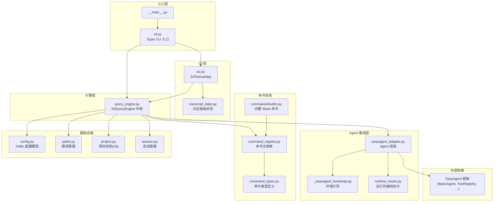
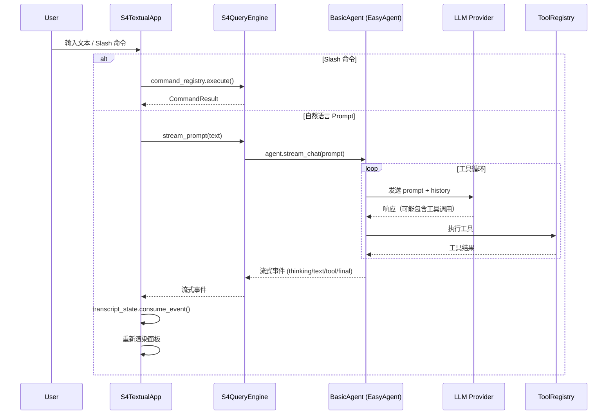

# S4Code 仓库阅读指南

## 项目定位

S4Code 是一个 **本地优先 (local-first) 的代码 Agent CLI**，构建在 [EasyAgent](file:///home/wxd/LLM/EasyAgent) 框架之上。它为开发者提供：
- 全屏 TUI 交互界面 (基于 Textual)
- 非交互式 CLI（单次 prompt、review、commit 等工作流）
- Slash 命令系统（会话管理、模型切换、权限控制等）
- YAML 配置 + 多模型 Profile
- 基于 EasyAgent 的工具生态（文件、Shell、代码智能、任务管理、多 Agent 协作等）

## 代码规模

整个 `s4code/` 目录约 **6,200 行 Python**，核心复杂度集中在 3 个文件：

| 文件 | 行数 | 职责 |
|------|------|------|
| `query_engine.py` | 2,328 | 中枢引擎，串联所有子系统 |
| `tui.py` | 1,161 | Textual 全屏 UI |
| `transcript_state.py` | 741 | 对话记录状态管理 |
| `easyagent_adapter.py` | 493 | EasyAgent 集成/组装层 |
| `commands/builtin.py` | 497 | Slash 命令实现 |
| 其余文件 | ~980 | 配置、路径、项目检测、类型定义等 |

## 架构总览

## 推荐阅读顺序

按以下顺序阅读，每一步都能建立在前一步的理解上：

---

### 第 1 层：基础设施（理解项目骨架）

#### 1. [paths.py](file:///home/wxd/LLM/S4Code/s4code/paths.py) — 路径管理 (87 行)
定义 `S4Paths` dataclass，管理所有文件/目录路径：配置文件、会话数据库、任务数据库、技能目录等。**入手最简单的文件**。

#### 2. [config.py](file:///home/wxd/LLM/S4Code/s4code/config.py) — 配置模型 (226 行)
Pydantic 模型定义：`S4Settings`（总配置）, `LLMSettings`, `UISettings`, `ProductSettings` 等。YAML 配置文件到内存对象的映射逻辑。

#### 3. [project.py](file:///home/wxd/LLM/S4Code/s4code/project.py) — 项目检测 (138 行)
`ProjectContext.detect(cwd)` — 自动检测当前目录是否为 Git 仓库，获取项目名、root 路径、diff 信息。

#### 4. [session.py](file:///home/wxd/LLM/S4Code/s4code/session.py) — 会话管理 (92 行)
`S4SessionManager` — 基于 EasyAgent 的 `SessionStore` 封装，管理会话 ID 生成、元数据构建、会话列表获取。

---

### 第 2 层：Agent 集成（理解核心驱动力）

#### 5. [_easyagent_bootstrap.py](file:///home/wxd/LLM/S4Code/s4code/_easyagent_bootstrap.py) — 环境引导 (84 行)
确保 EasyAgent 包的 `sys.path` 正确设置。在 `easyagent_adapter.py` 最顶部被调用。

#### 6. [easyagent_adapter.py](file:///home/wxd/LLM/S4Code/s4code/easyagent_adapter.py) — Agent 组装 (493 行)
**关键文件**。`build_agent_bundle()` 函数是整个系统的「工厂方法」：
- 创建 `EasyLLM` (LLM 客户端)
- 创建 `ToolRegistry` 并注册所有工具（文件、Shell、搜索、CodeIntel、MCP 等）
- 创建 `BasicAgent` 并配置权限、上下文管理、技能系统
- 返回 `S4AgentBundle` — 所有子系统的聚合对象

> [!TIP]
> 阅读这个文件时重点关注 `_register_base_tools()` 和 `build_agent_bundle()` 两个函数，它们揭示了 S4Code 注册了哪些工具、如何初始化 Agent。

#### 7. [runtime_hooks.py](file:///home/wxd/LLM/S4Code/s4code/runtime_hooks.py) — 运行时钩子 (75 行)
`S4RuntimeNoticeHook` — 在 Agent 的 Hook 系统中监听通知事件，供 TUI 侧边栏显示运行时消息。

---

### 第 3 层：中枢引擎（最复杂、最核心）

#### 8. [query_engine.py](file:///home/wxd/LLM/S4Code/s4code/query_engine.py) — 中枢引擎 (2,328 行)
**最大最重要的文件**。`S4QueryEngine` 是所有功能的汇聚点：

| 关注区域 | 行数范围（大致） | 说明 |
|----------|-----------------|------|
| `__init__` + 初始化 | 36-77 | 创建 Agent Bundle、恢复会话 |
| 技能管理 | 138-207 | Turn-scoped 技能激活/清理 |
| 观测指标 | 209-263 | LLM/工具调用的 round metrics |
| 会话管理 | 607-762 | save / resume / fork / rename |
| 模型切换 | 772-870 | 动态切换 LLM 模型/profile |
| 权限管理 | ~900-1100 | 运行时权限规则增删查 |
| Prompt 流式执行 | `stream_prompt()` | Agent 的核心调用入口 |
| 工具事件处理 | `_render_tool_event()` | 将工具结果转为 UI 事件 |
| Slash 命令支持方法 | 后半部分 | `format_*()`, `get_*_choices()` 等 |

> [!IMPORTANT]
> 不要试图一次读完这个文件。建议按功能域分批阅读：先看 `__init__` 和 `stream_prompt` 理解主流程，再按需深入具体功能域。

---

### 第 4 层：命令系统

#### 9. [command_types.py](file:///home/wxd/LLM/S4Code/s4code/command_types.py) — 类型定义 (72 行)
`SlashCommand`, `CommandResult`, `CommandInvocation` 等数据结构。

#### 10. [command_registry.py](file:///home/wxd/LLM/S4Code/s4code/command_registry.py) — 命令注册表 (51 行)
`S4CommandRegistry` — 解析 `/xxx` 输入、匹配命令、执行命令。

#### 11. [commands/builtin.py](file:///home/wxd/LLM/S4Code/s4code/commands/builtin.py) — 内置命令 (497 行)
所有 Slash 命令的具体实现：`/help`, `/model`, `/save`, `/resume`, `/permissions`, `/skills`, `/worktree`, `/agents`, `/hooks` 等。

---

### 第 5 层：UI 层

#### 12. [transcript_state.py](file:///home/wxd/LLM/S4Code/s4code/transcript_state.py) — 对话状态 (741 行)
`S4TranscriptState` — 管理 TUI 中的对话面板卡片（user/assistant/tool/thinking/error 等），处理流式事件的消费和状态转换。

#### 13. [tui.py](file:///home/wxd/LLM/S4Code/s4code/tui.py) — TUI 界面 (1,161 行)
`S4TextualApp` — Textual 全屏应用：
- 顶部 Header + 底部 Footer
- 左侧主区域：对话 transcript + 命令面板
- 右侧侧边栏：运行时状态
- 底部输入框：prompt 输入
- 命令面板（autocomplete + 上下键选择 + Tab 补全）

---

### 第 6 层：入口

#### 14. [cli.py](file:///home/wxd/LLM/S4Code/s4code/cli.py) — CLI 入口 (110 行)
Typer 应用，定义子命令：默认交互、`review`、`commit`、`config`、`doctor`、`session list`。

---

## 关键数据流

### 用户输入 → Agent 响应的完整流程

## 外部依赖：EasyAgent

S4Code 的核心 Agent 能力全部来自 EasyAgent 框架（位于 `/home/wxd/LLM/EasyAgent`）。S4Code 使用的关键 EasyAgent 组件：

| 组件 | 来源 | 用途 |
|------|------|------|
| `BasicAgent` | `agent` | Agent 主体，管理对话循环 |
| `EasyLLM` | `core.llm` | LLM 客户端抽象 |
| `ToolRegistry` | `Tool` | 工具注册/执行 |
| `SessionStore` | `db` | 会话持久化 |
| `PermissionContext` | `core.permissions` | 权限控制 |
| `ContextManager` | `context` | 上下文/历史压缩 |
| `SkillManager/SkillRegistry` | `skill` | 技能系统 |
| `CodeIntelManager` | `codeintel` | 代码智能 (LSP) |
| `TaskService` | `task` | 任务管理 |
| `ExecutionContext` | `runtime` | 运行时上下文 |

> [!NOTE]
> 如果你想深入理解某个工具（如 `FileEdit`, `Bash`）的具体实现，需要去 EasyAgent 仓库的 `Tool/builtin/` 目录查看。

## 文档资源

| 文档 | 内容 |
|------|------|
| [phase1_s4code_foundation.md](file:///home/wxd/LLM/S4Code/docs/phase1_s4code_foundation.md) | 基础架构设计 |
| [phase2_yaml_profiles_context.md](file:///home/wxd/LLM/S4Code/docs/phase2_yaml_profiles_context.md) | YAML 配置 + 模型 Profile |
| [phase3_pending_interactions.md](file:///home/wxd/LLM/S4Code/docs/phase3_pending_interactions.md) | 确认/交互式中断机制 |
| [phase4_palette_sessions_clipboard.md](file:///home/wxd/LLM/S4Code/docs/phase4_palette_sessions_clipboard.md) | 命令面板 + 会话 + 剪贴板 |
| [configuration_yaml.md](file:///home/wxd/LLM/S4Code/docs/configuration_yaml.md) | YAML 配置参考 |
| [workthrough.md](file:///home/wxd/LLM/S4Code/docs/workthrough.md) | 开发过程记录 |

## 快速定位表

想了解某个功能？直接跳到对应位置：

| 你想了解... | 去看... |
|------------|---------|
| 启动时加载了哪些工具？ | [easyagent_adapter.py → `_register_base_tools()`](file:///home/wxd/LLM/S4Code/s4code/easyagent_adapter.py#L149-L227) |
| 系统 Prompt 是什么？ | [easyagent_adapter.py → `S4_AGENT_SYSTEM_PROMPT`](file:///home/wxd/LLM/S4Code/s4code/easyagent_adapter.py#L47-L60) |
| Slash 命令怎么注册和执行？ | [commands/builtin.py](file:///home/wxd/LLM/S4Code/s4code/commands/builtin.py) + [command_registry.py](file:///home/wxd/LLM/S4Code/s4code/command_registry.py) |
| YAML 配置字段有哪些？ | [config.py](file:///home/wxd/LLM/S4Code/s4code/config.py) + [docs/configuration_yaml.md](file:///home/wxd/LLM/S4Code/docs/configuration_yaml.md) |
| 会话怎么保存/恢复？ | [query_engine.py → `save_session()` / `resume_session()`](file:///home/wxd/LLM/S4Code/s4code/query_engine.py#L693-L744) |
| TUI 界面怎么布局？ | [tui.py → `compose()` + CSS](file:///home/wxd/LLM/S4Code/s4code/tui.py#L49-L146) |
| 流式对话怎么处理？ | [query_engine.py → `stream_prompt()`](file:///home/wxd/LLM/S4Code/s4code/query_engine.py) |
| 权限系统怎么配置？ | [easyagent_adapter.py → `_build_permission_context()`](file:///home/wxd/LLM/S4Code/s4code/easyagent_adapter.py#L110-L124) |
| 技能系统怎么工作？ | [easyagent_adapter.py → `_discover_skill_registry()` 等](file:///home/wxd/LLM/S4Code/s4code/easyagent_adapter.py#L229-L348) |
